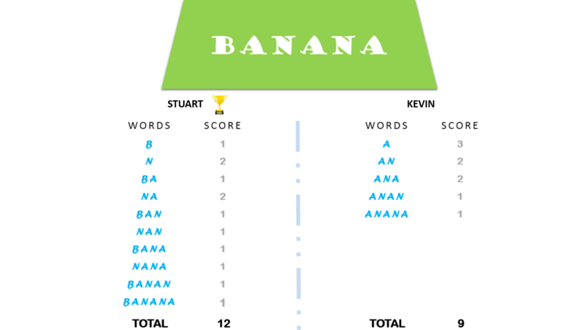

Kevin y Stuart quieren jugar al 'Juego de los Minions'.

## Reglas del juego

A ambos jugadores se les da la misma cadena, S.
Ambos jugadores tienen que hacer subcadenas usando las letras de la cadena S.
Stuart tiene que formar palabras que comiencen con consonantes.
Kevin tiene que formar palabras que comiencen con vocales.
El juego termina cuando ambos jugadores han hecho todas las subcadenas posibles.

## Puntuación
Un jugador obtiene +1 punto por cada aparición de la subcadena en la cadena S.

## Por ejemplo:
Cadena S = PLÁTANO
Palabra inicial de vocal de Kevin = ANA
Aquí, ANA aparece dos veces en BANANA. Por lo tanto, Kevin obtendrá 2 Puntos.

Para una mejor comprensión, vea la siguiente imagen:



Su tarea es determinar el ganador del juego y su puntuación.

## Impresiones

* cadena: el nombre del ganador y la puntuación, separados por un espacio en una línea, o Sorteo si no hay ganador
## Formato de entrada

Una sola línea de entrada que contiene la cadena S.
Nota: La cadena S contendrá solo letras mayúsculas: [A-Z].

## Restricciones
0 < len(S) <= 10^6


## Entrada de muestra
    
     ```
     BANANA
     ```
## Salida de muestra

     ```
    Stuart 12
     ```
