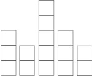
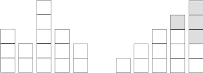

Una escalera es una construcción diseñada para comunicar varios espacios situados a diferentes alturas. Está conformada por escalones y puede disponer de varios tramos separados. Sin embargo no siempre contamos con ese tipo de construcciones y a veces es necesario improvisar. Enzo es un entusiasta de las escaleras y le encanta construirlas utilizando cualquier tipo de cajas de cualquier material siempre que estas tengan una forma cúbica. Enzo ha encontrado un almacén donde hay varias cajas apiladas (como se muestra en la figura de abajo) y planea utilizarlas para construir escaleras.

Así como Enzo es un entusiasta de las escaleras, es también algo flojo y no le gusta esforzarse demasiado en su labor, así que te pide tu ayuda para que construyas un programa que le diga para un conjunto de cajas apiladas, cual es la cantidad mínima de cajas que debe mover para construir una escalera. Por ejemplo, para las cajas apiladas de la figura anterior, tenemos que:

Enzo debe mover 4 cajas (las cajas sombreadas) de las cajas apiladas en la izquierda para formar la escalera de la parte derecha. La parte más alta de la escalera esta a la derecha.

Entrada
La entrada consiste de un numero c que es el número de casos, luego le siguen c líneas donde cada línea es un caso de prueba que consta de un numero n, (n será mayor que 2 y menor o igual que 500) que es la cantidad de pilas de cajas, posteriormente le siguen n números, donde cada número representa la cantidad de cajas en cada pila de cajas. En este problema se garantiza que cada entrada contiene el número exacto de cajas para formar una escalera perfecta, es decir una escalera donde la diferencia entre cada escalón será 1, por lo que nunca faltaran o sobraran cajas.

## Salida

Mostrar el la cantidad mínima de cajas que Enzo debe mover para construir una escalera.

## Ejemplo de Entrada

2

5 3 2 5 3 2

3 2 2 2

## Ejemplo de Salida

4  
1